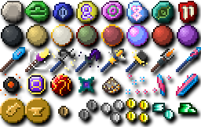

# Kompy's Textures

A collection of my textures that I've created for various modded MC projects, be it Tradewinds, Rebirth of the Night, or some old 1.7.10 mods or contenttweaker content.
All of these textures are available under a GPLv3 compat license, meaning you are free to use them in your own mods, modpacks, or other projects.

Some of these are animated, so check the .mcmeta folder. Some of these are also 32x, and as such, included them in separated folders for 16x and 32x.

License: [CC-BY 4.0 License](https://creativecommons.org/licenses/by/4.0/)

to-do: 
Upload my upscale script =3
Upload old model files
Upload old GUI textures
Upload PSDs and Aseprites
